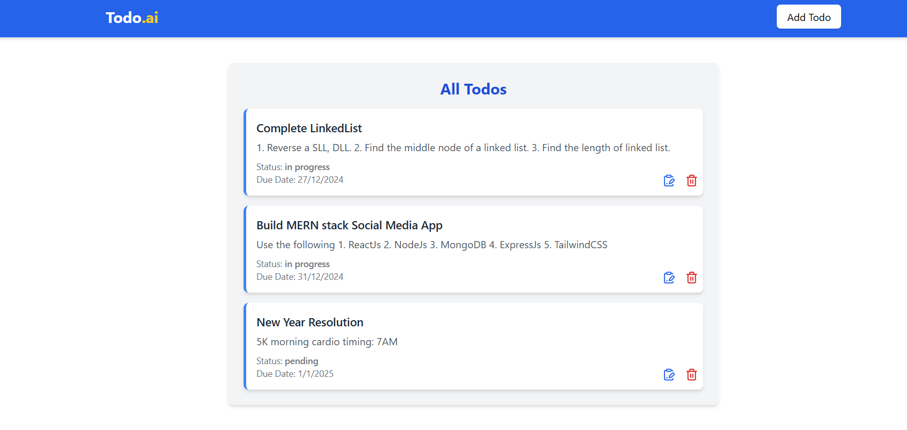
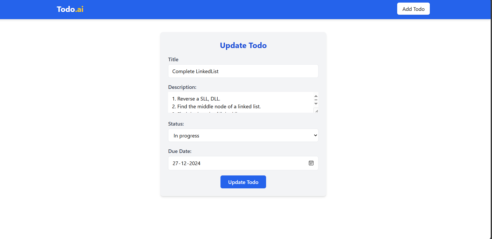
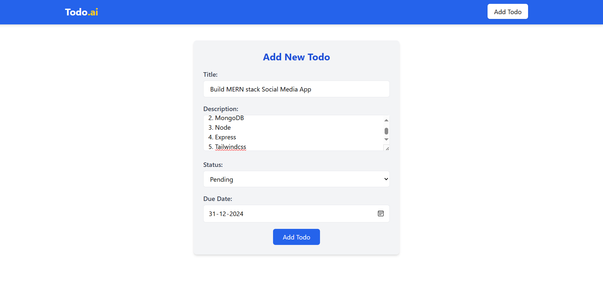
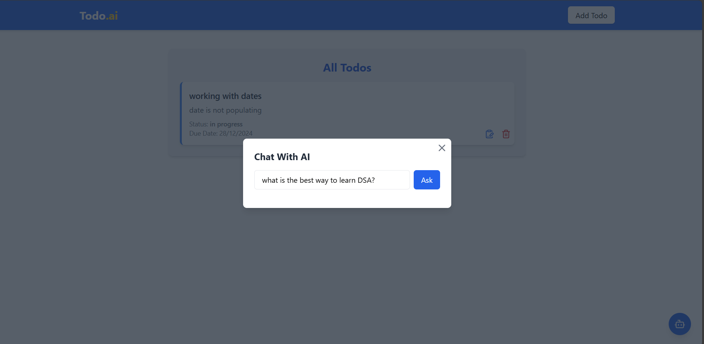
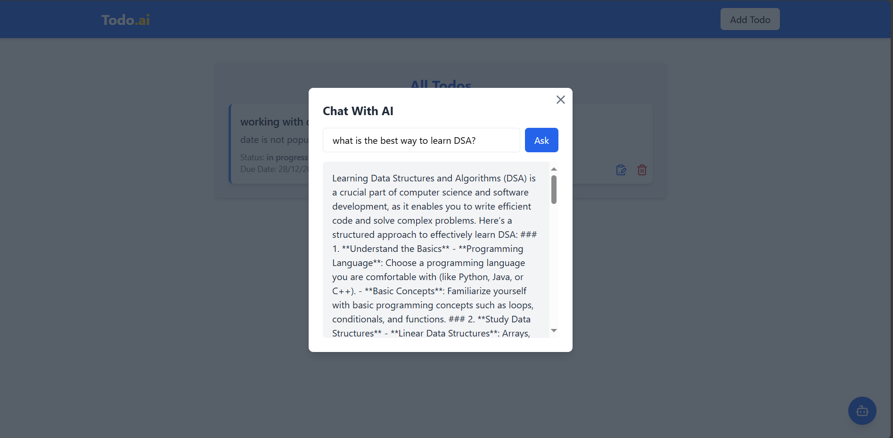

# 📝 **MERN Todo List with AI Chatbot Integration**

This project is a full-stack **MERN** (MongoDB, Express.js, React.js, Node.js) application where users can manage their tasks efficiently. It includes a **Todo List** for creating, updating, and deleting tasks, as well as an integrated **AI Chatbot** powered by the **ChatGPT API** to assist users with task-related queries.

Styled using **Tailwind CSS** for a clean, responsive UI.

---

## 🚀 **Features**

1. **Todo List Management**
   - Add new tasks.
   - Update existing tasks.
   - Delete tasks.

2. **AI Chatbot Assistant**
   - Input queries like: *"How can I complete task X?"*
   - Receive intelligent responses via ChatGPT API.

3. **Modern UI with Tailwind CSS**
   - Fully responsive design for all devices.
   - Sleek and minimal interface.

---

## 🛠️ **Tech Stack**

- **Frontend**: React.js + Tailwind CSS
- **Backend**: Node.js + Express.js
- **Database**: MongoDB (Mongoose)
- **AI Integration**: OpenAI's ChatGPT API

---

## 📸 **Screenshots**

1. **Todo List Interface**  
   
   
    

3. **AI Chatbot Interface**  
   
   

# Environment Variables in Backend

- **PORT**:  
- **MONGO_URI**:  
- **OPENAI_API_KEY**:  
